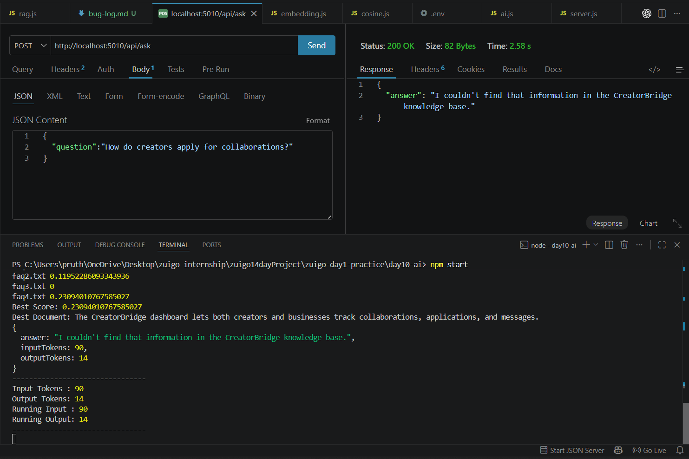

# Bug Log

---

## Bug 1

### Symptom

The API returned an error when a request was sent.

### Stack Trace

TypeError: Cannot destructure property 'question' of 'req.body'
File: server.js
Line: 20

### Hypotheses Tested

1. req.body is undefined ✅
2. Wrong API endpoint ❌
3. Invalid API key ❌

### Root Cause

The request body was not sent as JSON, so Express could not populate req.body.

### Verified Fix

Sent a JSON body with the correct Content-Type header.

### Why It Works

Express parses JSON requests into req.body. Once the request was formatted correctly, the application received the question successfully.

## Bug 2

### Symptom

The chatbot always responded:
"I couldn't find that information..."

### Stack Trace

No runtime error occurred.

### Hypotheses Tested

1. Gemini API failure ❌
2. RAG retrieval returned weak context ✅
3. Invalid environment variables ❌

### Root Cause

The retrieval process selected poor context because the current embedding approach only counts matching words.

### Verified Fix

Still under investigation. The next step is to compare results using a real embedding provider.

### Why It Matters

Poor retrieval prevents the AI from receiving useful context, even though the API itself works correctly.

## Bug 3

### Symptom

The API returned:
Cannot read property 'question'

### Stack Trace

server.js line XX

### Hypotheses Tested

...

### Root Cause

A variable name was intentionally changed from
question to questions.

### Verified Fix

Restored the correct variable name.

### Why It Works

The application now reads the correct property from the request body.

